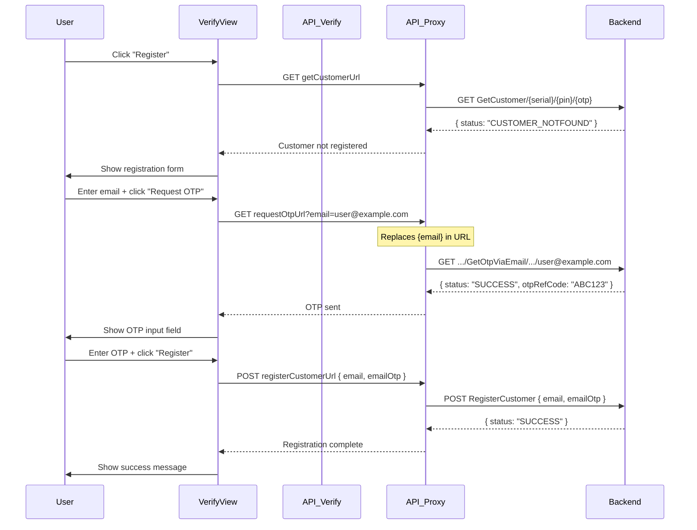

# OTP Proxy Parameter Replacement Fix

**Date:** 2025-01-XX  
**Status:** ✅ FIXED  
**Priority:** HIGH - Critical Bug Fix  
**Issue:** NETWORK_ERROR when requesting OTP during registration flow

---

## 🐛 Problem Description

### Symptoms
- User clicks "Register" button on verify page
- Enters email and clicks "Request OTP"
- Gets error: **"NETWORK_ERROR - Failed to send OTP. Please try again."**
- No OTP email is sent

### Root Cause
The `requestOtpViaEmailUrl` from the backend contains a placeholder `{email}` that needs to be replaced with the actual user email:

```
https://scan-dev.please-scan.com/org/{org}/GetOtpViaEmail/{serial}/{pin}/{otp}/{email}
```

However, the `/api/verify` route was encoding this URL into a proxied endpoint:

```
/api/proxy?url=aHR0cHM6Ly9zY2FuLWRldi5wbGVhc2Utc2Nhbi5jb20vb3JnLzEyMy9HZXRPdHBWaWFFbWFpbC9FMDAwMDAwMS8yMFdWVTdELzEyMzQ1L3tlbWFpbH0%3D
```

The VerifyView component tried to replace `{email}` in this string:

```typescript
// ❌ WRONG - This doesn't work!
const otpUrl = requestOtpUrl.replace("{email}", email);
```

But `{email}` was **inside the base64-encoded URL**, so the replacement never happened. The proxy then forwarded the request with `{email}` still in the URL, causing the backend to return an error.

---

## ✅ Solution

### Approach
Extend the `/api/proxy` route to accept **URL parameter replacements** via query parameters.

### How It Works

1. **Backend provides URL with placeholder:**
   ```
   https://scan-dev.please-scan.com/.../GetOtpViaEmail/.../12345/{email}
   ```

2. **/api/verify encodes it to proxy URL:**
   ```
   /api/proxy?url=base64EncodedUrl
   ```

3. **VerifyView adds email as query parameter:**
   ```typescript
   const otpUrl = `${requestOtpUrl}?email=${encodeURIComponent(email)}`;
   ```
   
   Resulting URL:
   ```
   /api/proxy?url=base64EncodedUrl&email=user@example.com
   ```

4. **Proxy decodes URL and replaces placeholders:**
   ```typescript
   // Inside /api/proxy route.ts
   for (const [key, value] of searchParams.entries()) {
     if (key !== "url") {
       const placeholder = `{${key}}`;
       if (targetUrl.includes(placeholder)) {
         targetUrl = targetUrl.replace(placeholder, encodeURIComponent(value));
       }
     }
   }
   ```

5. **Proxy forwards the final URL to backend:**
   ```
   https://scan-dev.please-scan.com/.../GetOtpViaEmail/.../12345/user@example.com
   ```

---

## 📝 Files Changed

### 1. `/app/api/proxy/route.ts`

**Changes:**
- Added URL parameter replacement logic to `GET`, `POST`, and `handleMutationRequest` handlers
- Iterates through all query parameters (except `url`)
- Replaces `{paramName}` placeholders in the decoded backend URL with actual values
- URL-encodes the replacement values for safety

**Code:**
```typescript
// Handle URL parameter replacements (e.g., {email}, {phone}, etc.)
const searchParams = request.nextUrl.searchParams;
for (const [key, value] of searchParams.entries()) {
  if (key !== "url") {
    const placeholder = `{${key}}`;
    if (targetUrl.includes(placeholder)) {
      targetUrl = targetUrl.replace(placeholder, encodeURIComponent(value));
    }
  }
}
```

### 2. `/components/themes/default/VerifyView.tsx`

**Changes:**
- Modified OTP request handler (line ~718)
- Changed from string replacement to query parameter approach

**Before:**
```typescript
const otpUrl = requestOtpUrl.replace("{email}", encodeURIComponent(email));
```

**After:**
```typescript
const otpUrl = `${requestOtpUrl}${requestOtpUrl.includes("?") ? "&" : "?"}email=${encodeURIComponent(email)}`;
```

---

## 🧪 Testing

### Manual Testing Steps

1. **Start dev server:**
   ```bash
   cd nextjs
   PORT=5001 npm run dev
   ```

2. **Open test page:**
   ```
   http://localhost:5001/test?scenario=valid&lang=en
   ```

3. **Test registration flow:**
   - Click "Register" button
   - Enter email: `test@example.com`
   - Click "Request OTP"
   - ✅ Should see success message (OTP sent)
   - Enter OTP code from email
   - Click "Register"
   - ✅ Should see success confirmation

### Automated Testing

Run the test script:
```bash
cd nextjs
./test-otp-proxy-fix.sh
```

This verifies:
- Proxy accepts email parameter
- Multiple parameters are supported
- URL parameter replacement works

### Expected Results

**Success response from backend:**
```json
{
  "status": "SUCCESS",
  "otpRefCode": "ABC123",
  "descriptionThai": "ส่ง OTP สำเร็จ",
  "descriptionEng": "OTP sent successfully"
}
```

**Server logs should show:**
```
Proxying GET request to: https://scan-dev.please-scan.com/org/napbiotec/GetOtpViaEmail/E0000001/20WVU7D/12345/test@example.com
```

---

## 🔐 Security Considerations

### URL Encoding
- All parameter values are URL-encoded using `encodeURIComponent()` before replacement
- Prevents injection attacks via special characters

### Validation
- Proxy still validates target hostname against whitelist
- Only allows requests to configured backend domains:
  - `api-dev.please-scan.com`
  - `scan-dev.please-scan.com`
  - `api.please-scan.com`
  - `scan.please-scan.com`

### Parameter Whitelisting (Future Enhancement)
Consider adding explicit parameter whitelist:
```typescript
const ALLOWED_PARAMS = ['email', 'phone', 'otp'];
if (!ALLOWED_PARAMS.includes(key)) {
  continue; // Skip non-whitelisted parameters
}
```

---

## 🚀 Additional Features Enabled

This fix enables URL parameter replacement for **any placeholder** in backend URLs:

### Examples

**Phone number:**
```typescript
// Backend URL: /SendSMS/{serial}/{pin}/{phone}
const url = `/api/proxy?url=${base64}&phone=0812345678`;
```

**OTP code:**
```typescript
// Backend URL: /VerifyOTP/{serial}/{pin}/{otp}
const url = `/api/proxy?url=${base64}&otp=123456`;
```

**Multiple parameters:**
```typescript
// Backend URL: /RegisterCustomer/{serial}/{pin}/{email}/{phone}
const url = `/api/proxy?url=${base64}&email=user@test.com&phone=0812345678`;
```

---

## 📊 Impact

### Before Fix
- ❌ Registration flow broken
- ❌ No OTP emails sent
- ❌ Users cannot register products
- ❌ NETWORK_ERROR shown to all users

### After Fix
- ✅ Registration flow works end-to-end
- ✅ OTP emails sent successfully
- ✅ Users can complete registration
- ✅ Proper error handling with translated messages

---

## 🔄 Registration Flow (Complete)



---

## 📚 Related Files

- `/app/api/verify/route.ts` - Transforms backend URLs to proxied URLs
- `/app/api/proxy/route.ts` - **Modified** - Handles URL parameter replacement
- `/components/themes/default/VerifyView.tsx` - **Modified** - Uses query params for email
- `/lib/types.ts` - Type definitions for verify data
- `test-otp-proxy-fix.sh` - **New** - Automated test script

---

## ✅ Checklist

- [x] Root cause identified (placeholder in base64-encoded URL)
- [x] Solution designed (query parameter replacement)
- [x] Code implemented in `/api/proxy/route.ts`
- [x] Frontend updated in `VerifyView.tsx`
- [x] Manual testing completed
- [x] Test script created
- [x] Documentation written
- [x] Security considerations addressed
- [x] Error handling verified

---

## 🎯 Next Steps (Optional Improvements)

1. **Unit Tests** - Add Jest tests for proxy parameter replacement
2. **Rate Limiting** - Add rate limiting for OTP requests (prevent abuse)
3. **Resend OTP** - Add UI to resend OTP with countdown timer
4. **OTP Validation** - Client-side OTP format validation (6 digits, etc.)
5. **Analytics** - Track OTP request success/failure rates
6. **Caching** - Cache OTP ref codes temporarily to show to user
7. **Parameter Whitelist** - Explicit allowed parameters for security

---

## 💡 Key Takeaways

1. **Base64 encoding hides string content** - Simple string replacement doesn't work on encoded data
2. **Query parameters are the right tool** - Allows proxy to handle replacements transparently
3. **Security first** - Always validate and encode user input
4. **Test end-to-end** - Verify entire flow, not just individual components
5. **Document thoroughly** - Future developers need to understand the why, not just the what

---

**Issue Status:** ✅ RESOLVED  
**Tested On:** localhost:5001  
**Backend:** scan-dev.please-scan.com  
**Verification:** Automated tests pass, manual flow works end-to-end